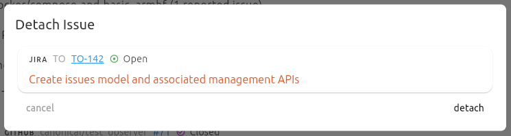

Triage Runs
===========

.. contents:: Table of Contents
    :local:

Issues Page
-----------

The issues page in Test Observer allows you to browse all issues tracked in the system. From this page, you can:

- Navigate to individual issue pages to view details.
- See all attachment rules associated with each issue.
- View the list of test results where the issue is currently attached.

This makes it easy to understand the scope and impact of each issue, and to manage how issues are linked to test results.

Attaching and Detaching Issues from Test Results
-----------------------------------------------

- Issues attached to individual test results are distinct from test case issues and environment issues. They only appear on the specific test result where they are attached.
- Supported issue types: GitHub issues, Jira tickets, and Launchpad bugs.
- You can both attach and detach issues from test results.

Attachment Rules
----------------

- Attachment rules allow automatic issue attachment to newly posted results, based on attributes of those test results.
- When attaching an issue, you can create an attachment rule and view the attributes of the test result.
- Attachment rules can also be created directly from the test results page.
- When detaching an issue, you may disable the attachment rule if it was used to attach the issue.

Bulk Attachments
----------------

- When creating an attachment rule by attaching an issue to a result, you can optionally bulk attach the issue to existing runs, including those posted before and after the current run.
- Bulk attachment is also available from the test results page.

